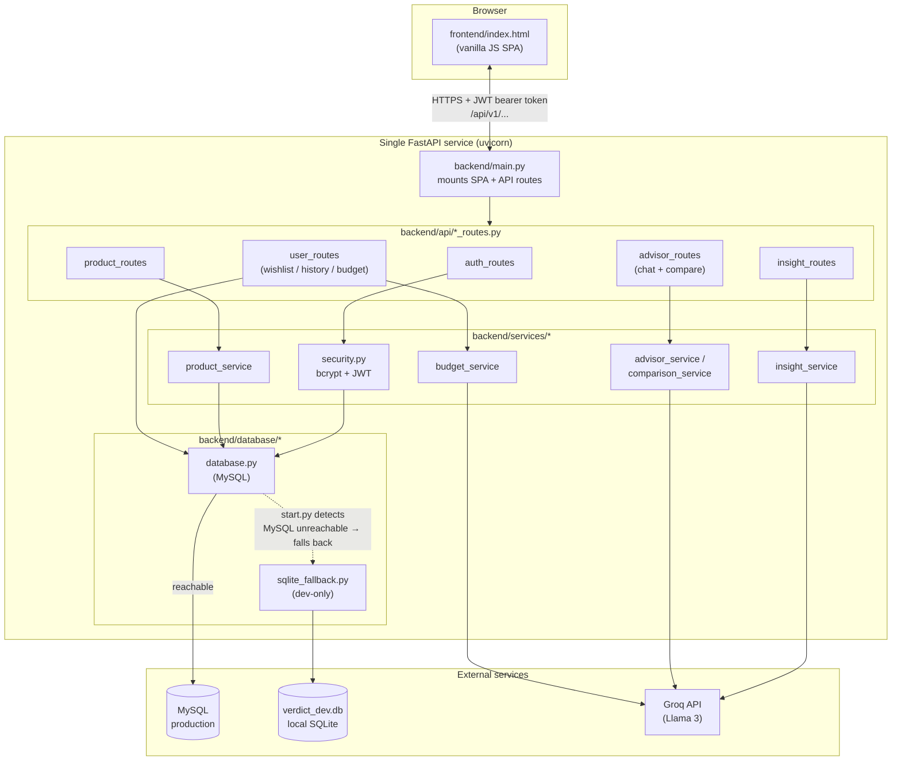

# ⚖️ Verdict — Shop the truth.

**Verdict** is an AI-powered shopping intelligence platform for Indian e-commerce. Search
across five retailers at once, get an AI verdict on which result is actually worth buying,
compare products side by side, plan a budget, and keep a wishlist and search history — all
behind real authentication, in one FastAPI service that also serves its own frontend.

No build step. No separate frontend server. No MySQL required to try it.

```bash
pip install -r requirements.txt
python start.py
```

Open `http://localhost:8000/`, log in with `demo@verdict.ai` / `verdict123`, or sign up.

---

## Table of contents

- [Features](#features)
- [Tech stack](#tech-stack)
- [Architecture](#architecture)
- [Quick start](#quick-start)
- [Manual setup (real MySQL)](#manual-setup-real-mysql)
- [Project structure](#project-structure)
- [Authentication](#authentication)
- [API reference](#api-reference)
- [Testing](#testing)
- [Bugs found & fixed](#bugs-found--fixed)
- [Known limitations & roadmap](#known-limitations--roadmap)
- [Deployment](#deployment-render)

---

## Features

- **Multi-retailer search** — Amazon, Flipkart, Myntra, Ajio, Meesho, with price/rating/discount filters and sorting.
- **AI insights** — lowest price, best discount, top rated, and a computed "best value" pick, with an AI-written summary (Groq Llama 3, with a rule-based fallback if the AI call fails).
- **Side-by-side compare** — pick up to 3 products, get a static spec table plus an AI-written comparison verdict.
- **Ask Verdict** — a chat assistant that has the products currently on screen as context.
- **Wishlist** — save, filter, sort, remove, clear.
- **Search log** — history of past searches, re-run any of them, delete or clear.
- **Budget planner** — hand it a budget and a goal, get an AI-allocated spending plan with per-category suggestions, plus a history of past plans.
- **Real authentication** — bcrypt-hashed passwords, JWT sessions, and per-user data isolation (see [Authentication](#authentication)).

## Tech stack

| Layer | Technology |
|---|---|
| Backend | FastAPI |
| Frontend | Single-file HTML/CSS/JS SPA (no framework, no build step) |
| Database | MySQL in production, SQLite automatically in local dev (see below) |
| AI | Groq API (Llama 3) |
| Auth | bcrypt (passlib) + JWT (PyJWT) |
| Deployment | Render (one service — see `render.yaml`) |

---

## Architecture



**How a request flows:** the browser talks to one origin only — the same FastAPI process
serves the SPA at `/` and the JSON API at `/api/v1/...`, so there's no CORS to configure
and nothing to keep in sync between separate deploys. Every protected route resolves the
caller's identity from the JWT before touching the service layer, and the service layer
never knows or cares whether `database.py` is backed by MySQL or the local SQLite
fallback — `start.py` decides that once at boot by probing MySQL reachability, and
everything above that line stays identical either way. AI-backed features (insights,
compare, chat, budget planning) call out to Groq and fall back to deterministic
rule-based logic if that call fails, so the app stays usable with zero network access.

---

## Quick start

```bash
pip install -r requirements.txt
python start.py
```

`start.py` is a single-file launcher that:

1. **Bootstraps `.env`** — copies it from `.env.example` if it doesn't exist, and generates a real random `JWT_SECRET` instead of leaving the insecure placeholder in place.
2. **Checks whether MySQL is reachable** using whatever's in `.env`. On a first run, before you've set up a database, it won't be — so it **transparently falls back to a local SQLite file** (`verdict_dev.db`) with the same schema and the same demo account. Nothing else in the codebase knows or cares which one it's talking to.
3. **Starts one process** that serves the API (`/api/v1/...`) and the frontend (`/`) together, and opens your browser.

Flags:
```bash
python start.py --install       # pip install -r requirements.txt first, then run
python start.py --port 9000     # default is 8000, or $PORT if set
python start.py --no-browser    # don't auto-open a tab
python start.py --force-sqlite  # use the local SQLite file even if MySQL is configured
python start.py --reload        # auto-restart on code changes, for active development
```

The SQLite fallback is **for local development only**. Point `DB_*` in `.env` at a real
MySQL server (and run `schema.sql` against it) before deploying — `start.py` will detect
it's reachable and use it automatically, no flag needed.

## Manual setup (real MySQL)

```bash
pip install -r requirements.txt
cp .env.example .env
# fill in DB_* and GROQ_API_KEY, and set a real JWT_SECRET:
python3 -c "import secrets; print(secrets.token_hex(32))"

mysql -u root -p < schema.sql
uvicorn backend.main:app --reload --host 0.0.0.0 --port 8000
```

If the frontend is ever served from a different origin than the API, open it once with
`?api=https://your-api-host` — the override is remembered in `localStorage` after that.

---

## Project structure

```
verdict/
├── backend/
│   ├── api/                      # route handlers
│   │   ├── auth_routes.py        # register / login / me + get_current_user dependency
│   │   ├── product_routes.py
│   │   ├── insight_routes.py
│   │   ├── advisor_routes.py     # chat + compare
│   │   └── user_routes.py        # wishlist / history / budget
│   ├── services/                 # business logic, one file per domain
│   ├── database/
│   │   ├── database.py           # real MySQL implementation
│   │   └── sqlite_fallback.py    # dev-only fallback used by start.py
│   ├── models/models.py          # every Pydantic request/response schema
│   ├── utils/
│   │   ├── config.py             # env-backed settings
│   │   ├── security.py           # password hashing + JWT
│   │   └── logger.py
│   └── main.py                   # FastAPI app, mounts the SPA
├── frontend/
│   └── index.html                # the entire frontend — no build step
├── tests/
│   ├── fake_db.py                # in-memory DB stand-in, used only by the test suite
│   └── test_integration.py       # 45 end-to-end checks against the real app
├── start.py                      # one-command launcher
├── schema.sql                    # MySQL schema
├── requirements.txt
├── .env.example
├── render.yaml
└── README.md
```

---

## Authentication

Every `/api/v1/...` route except `/auth/register` and `/auth/login` requires a valid
bearer token:

```
Authorization: Bearer <token>
```

- Passwords are hashed with bcrypt (`passlib`), never stored or logged in plain text.
- Sessions are JWTs signed with `JWT_SECRET`, 7 days by default (`JWT_EXPIRE_MINUTES`).
- Routes with a `user_id` in the **path** (`/user/wishlist/{user_id}`, `/user/history/{user_id}`, `/user/budget/history/{user_id}`) check it against the token's owner and return **403** if it doesn't match — you can't read or delete someone else's data by changing a number in the URL.
- Routes that take `user_id` in the **body** (`/products/search`, `/user/wishlist/add`, `/user/budget/plan`) silently overwrite it with the authenticated user's real id. The field is kept in the schema for backward compatibility, but a client can't spoof it.
- The frontend stores the token in `localStorage`, attaches it to every request, and bounces back to the login screen on a `401` (e.g. an expired session) instead of failing silently.

Demo account: `demo@verdict.ai` / `verdict123` (works on both MySQL and the SQLite fallback — same bcrypt hash is seeded in both).

---

## API reference

| Method | Endpoint | Auth | Notes |
|---|---|---|---|
| POST | `/api/v1/auth/register` | — | Create an account, returns a token |
| POST | `/api/v1/auth/login` | — | Returns a token |
| GET | `/api/v1/auth/me` | ✓ | Current user |
| POST | `/api/v1/products/search` | ✓ | `user_id` in the body is ignored in favor of the token |
| POST | `/api/v1/insights/generate` | ✓ | |
| POST | `/api/v1/advisor/chat` | ✓ | |
| POST | `/api/v1/advisor/compare` | ✓ | Needs 2–3 products (422 if fewer — enforced by Pydantic, see below) |
| GET/POST/DELETE | `/api/v1/user/wishlist/...` | ✓ | 403 if `{user_id}` in the path isn't yours |
| GET/DELETE | `/api/v1/user/history/...` | ✓ | 403 if `{user_id}` in the path isn't yours |
| POST/GET | `/api/v1/user/budget/...` | ✓ | 403 if `{user_id}` in the path isn't yours |
| GET | `/health` | — | Liveness check |
| GET | `/docs` | — | Interactive Swagger UI |

Full request/response schemas are in `backend/models/models.py` and browsable live at `/docs`.

---

## Testing

```bash
pip install -r requirements.txt
python3 tests/test_integration.py
```

This boots the **actual FastAPI app** (`backend.main.app`) behind Starlette's
`TestClient` and drives it through the real routing, dependency injection, and Pydantic
validation — the only thing swapped out is the database (`tests/fake_db.py`, an in-memory
stand-in patched into the service layer, so the suite needs no MySQL server to run).

**45/45 checks currently pass**, verified from a completely fresh `python -m venv` with
nothing installed but the exact pins in `requirements.txt` — not just re-confirmed in an
environment that already happened to have compatible packages lying around. Coverage
includes: every protected route rejecting no/garbage/expired tokens; 403s on cross-user
access attempts; a spoofed `user_id` in a request body landing under the real authenticated
user instead; the full register → login → `/me` flow; product search filters actually
filtering; `/advisor/compare` returning a real summary instead of crashing; chat and
budget planning both exercising their rule-based fallback paths correctly with no network
access at all; and the SPA/API/docs routing all resolving to the right handler.

Re-run this after any backend change — it's a regression suite, not a demo script.

---

## Bugs found & fixed

This project went through several rounds of adversarial review — running the actual code
in isolated environments rather than trusting that it looked right — and turned up real
bugs at every layer. Documented here for transparency and so nobody reintroduces them.

### 🔴 Critical

**1. The app didn't boot at all on a clean install.**
`requirements.txt` pinned `groq==0.9.0` but left `httpx` unpinned. A plain `pip install -r
requirements.txt` resolves `httpx` to `0.28.x`, which removed the `proxies` kwarg that
groq 0.9.0's internal client wrapper still passes — every service module that
instantiates a `Groq` client at import time (`advisor_service`, `budget_service`,
`comparison_service`, `insight_service`) crashed with `TypeError` on import, which took
`backend/main.py` down with it. This reproduced on a completely fresh
`python -m venv && pip install -r requirements.txt` — exactly how anyone deploying this
for the first time would hit it.
*Fix:* pinned `httpx==0.27.2`. *Verified:* fresh venv, exact pins, app imports and the full test suite passes.

**2. Any user could read or delete any other user's data.**
Before authentication was added, `/user/wishlist/{user_id}`, `/user/history/{user_id}`,
and friends took `user_id` as a bare path parameter with no check that the caller *was*
that user — changing a number in the URL was enough to see or delete someone else's
wishlist, search history, or budget plans.
*Fix:* JWT auth on every route, with an explicit ownership check (`require_owner()`) on
every path that takes a `user_id`, returning 403 on mismatch. *Verified:* test suite
asserts a 403 when a token for user A is used against user B's wishlist.

**3. The demo account couldn't log in.**
The original `users` table had no password column at all — there was no login flow, so it
didn't matter, but it also meant there was no way to add one without a schema change.
*Fix:* added `password_hash` to the schema and seeded the demo user with a real bcrypt
hash for `verdict123`. *Verified:* live login against both the MySQL schema and the
SQLite fallback.

### 🟠 Functional

**4. `/advisor/compare` crashed on every single call.**
```python
f"  Original Price: ₹{p.original_price:.0f if p.original_price else p.price:.0f}\n"
```
A ternary expression inside an f-string **format spec** — not valid Python. This raised
`ValueError` unconditionally, before the function's own try/except even had a chance to
run, so the comparison feature was completely unreachable regardless of whether the Groq
API was available.
*Fix:* moved the conditional out of the format spec into a plain variable. *Verified:*
test asserts a 200 with a real summary body, not a 500.

**5. Two "Clear All" buttons pointed at the wrong thing.**
Earlier iterations of the frontend called `DELETE /user/history/{user_id}/clear` before
I'd seen the real backend and assumed the endpoint didn't exist, working around it with a
client-side loop over individual deletes. Once the actual `user_routes.py` was available,
it turned out the real bulk-delete endpoints (`/wishlist/{user_id}/clear`,
`/history/{user_id}/clear`) existed all along — the fix was to just call them directly.
*Verified:* test suite calls both `/clear` endpoints and asserts the collection is empty afterward.

**6. Budget plan responses were read with the wrong field names.**
An earlier draft of the frontend assumed allocation objects looked like
`{"category": ..., "amount": ...}`; the real `BudgetAllocation` model uses
`{"item": ..., "allocated": ..., "percentage": ..., "suggestion": ...}`. Every allocation
row would have rendered blank.
*Fix:* frontend reads the real field names. *Verified:* test asserts all four keys are
present on every returned allocation.

### 🟡 Minor

**7. Comparison table always appended "…" to product names**, even ones already short
enough not to need truncating. Fixed to only append it when the name actually exceeds the
truncation length.

**8. Validation errors displayed as raw JSON.**
FastAPI/Pydantic 422 responses return `detail` as a list of `{loc, msg, type}` objects,
not a string. The frontend's error handling didn't know that and dumped the raw array
into the login/signup error box. *Fix:* added `formatApiError()` to turn that into a
readable message (e.g. `password: String should have at least 6 characters`). *Verified:*
test asserts the 422 shape directly, tied to this fix.

**9. Dead code in `advisor_routes.py`.** The handler for `/advisor/compare` has:
```python
if len(request.products) < 2:
    raise HTTPException(status_code=400, ...)
```
This can never run. `ComparisonRequest.products` is declared with `Field(..., min_length=2,
max_length=3)`, so Pydantic already rejects a request with fewer than 2 products at the
schema level with a **422**, before the handler body ever executes. Not fixed (it's
harmless and removing it is a style choice, not a correctness one) but documented so it
isn't mistaken for working input validation — the *actual* validation is the Pydantic
field constraint.

**10. `start.py`'s own MySQL reachability check had a bug before it shipped.**
`mysql.connector.connect(connection_timeout=2.0)` — the connector requires an `int` here,
not a `float`, so every reachability check threw `TypeError` and was misreported as
"MySQL not reachable" for the wrong reason. Functionally harmless (it still fell back to
SQLite correctly either way) but the diagnostic message was wrong. *Fix:* pass `2`, not
`2.0`. *Verified:* the printed error now shows the real connection failure reason (e.g.
`Can't connect to MySQL server on 'localhost:3306'`) instead of a `TypeError`.

### 🎨 Design

**11. The color palette read as a plant/mineral theme, not a shopping product.** The
original dark theme used a green-tinted background (`#0B0F0D` with a jade `#6FA287`
accent) that came across as botanical rather than premium-commerce. *Fix:* moved to a
neutral graphite base with zero green channel bias, an indigo primary accent, and gold for
deals/pricing — kept green only where it's semantically meaningful (discount/savings
badges), instead of it bleeding into the whole UI. Also caught and fixed two button hover
states that had the old colors hardcoded directly instead of through CSS variables, which
would have left green flashes on hover even after the rest of the palette changed.

---

## Known limitations & roadmap

- **SQLite fallback is dev-only.** It has no connection pooling and isn't tuned for
  concurrent writes — fine for trying the app out or local development, not for
  production traffic. Configure real MySQL for anything beyond that.
- **No refresh tokens.** Sessions are a single flat JWT with a 7-day expiry; there's no
  shorter-lived access token + refresh token pair if you want tighter session control.
- **No rate limiting** on `/auth/login` or `/auth/register`.
- **No pagination** on search results, wishlist, or history — fine at current scale
  (products are generated per-search, not a real catalog), worth adding if that changes.
- **Price-drop alerts** — comparing a wishlist item's saved price against a fresh search
  result for the same product/retailer and surfacing a badge when it's dropped — would be
  a natural next feature given the data already being cached.

---

## Deployment (Render)

One service — see `render.yaml`. `uvicorn` serves both the API and the SPA, so there's
nothing to keep in sync between separate frontend/backend deploys.

1. Push to GitHub, create a Web Service on Render pointing at this repo.
2. Set the env vars from `render.yaml`: DB credentials, `GROQ_API_KEY`, and a real
   `JWT_SECRET` (not the dev default — generate one with
   `python3 -c "import secrets; print(secrets.token_hex(32))"`).
3. Provision MySQL and run `schema.sql` against it.
4. Deploy. The same URL serves `/` (the app) and `/api/v1/...` (the API).
